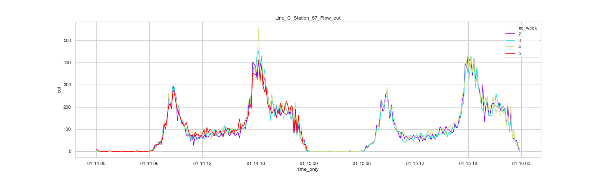

# Passenger Flow Prediciton
The repository contains the solution to a data competition on Tianchi.
- Link to competition: [https://tianchi.aliyun.com/competition/entrance/231708/introduction](https://tianchi.aliyun.com/competition/entrance/231708/introduction)

# Context
Ten-minute interval passenger flow data at each station and subway line is provide from Jan 1, 2019 to Jan 25, 2019 as training data. The competition requires building a supervised learning model to predict the passenger flow on a future date. Mean Absolute Error (MAE) is used as evaluation metric.

# Approach
## Exploratory Analysis
The demand pattern at each station and subway line is manually examined to identify some potential patterns. Below is a quick snapshot for one of the stations in the dataset.

  

## Main temporal Features
- Passenger flow on the same time interval and same weekday in last week
- Passenger flow on the same time interval (+/- 10min, +/- 20min) and same weekday in last week

## Model Training
- Light GBM is used as solution algorithm 
